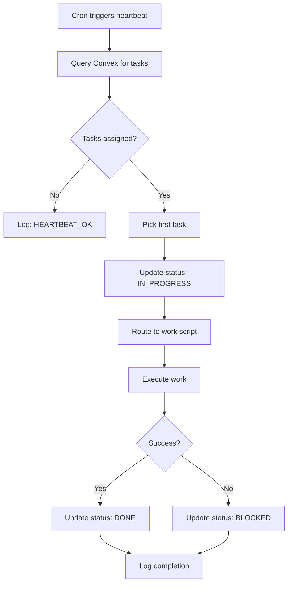

# Mission Control - Autonomous Agent Setup

**Created:** 2026-02-02
**Status:** ✅ Ready for deployment

---

## 🤖 What We Built

Fully autonomous agent coordination system with:

- ✅ **Shared heartbeat library** — Common functions for all agents
- ✅ **Agent-specific heartbeat scripts** — Vision, Fury, Quill
- ✅ **Work routing logic** — Tasks auto-routed to correct handler
- ✅ **Convex integration** — Real-time task coordination
- ✅ **Logging system** — Task-specific logs in `/tasks/logs/`

---

## 📁 File Structure

```
/root/.openclaw/workspace/agents/
├── shared/
│   └── heartbeat-lib.sh          # Shared heartbeat functions
├── vision/
│   ├── heartbeat.sh              # Vision's autonomous heartbeat
│   ├── content-production.sh     # Article drafting
│   ├── wordpress-publish.sh      # WordPress publishing
│   ├── seo-optimization.sh       # SEO audits
│   └── generic-work.sh           # Fallback handler
├── fury/
│   ├── heartbeat.sh              # Fury's autonomous heartbeat
│   ├── serp-analysis.sh          # SERP/competitor research
│   ├── keyword-research.sh       # Keyword research
│   └── generic-work.sh           # Fallback handler
└── quill/
    ├── heartbeat.sh              # Quill's autonomous heartbeat
    ├── brand-strategy.sh         # Brand identity work
    ├── content-strategy.sh       # Content calendar/strategy
    ├── gtm-strategy.sh           # GTM planning
    └── generic-work.sh           # Fallback handler
```

---

## ⚙️ How It Works

### Agent Heartbeat Flow



### Task Routing Logic

**Vision** routes to:
- `content-production.sh` → "Week X Content", "Draft Article"
- `seo-optimization.sh` → "SEO", "Audit"
- `wordpress-publish.sh` → "WordPress", "Publish"
- `generic-work.sh` → Everything else

**Fury** routes to:
- `serp-analysis.sh` → "SERP", "Competitor"
- `keyword-research.sh` → "Keyword"
- `generic-work.sh` → Everything else

**Quill** routes to:
- `brand-strategy.sh` → "Brand", "Identity"
- `content-strategy.sh` → "Content Strategy", "Calendar"
- `gtm-strategy.sh` → "GTM", "Marketing Plan"
- `generic-work.sh` → Everything else

---

## 🚀 Deployment Steps

### Step 1: Install Crontabs

Add these entries to crontab (`crontab -e`):

```bash
# Vision - Every 15 minutes
*/15 * * * * /root/.openclaw/workspace/agents/vision/heartbeat.sh >> /root/.openclaw/workspace/agents/logs/vision-cron.log 2>&1

# Fury - Every 15 minutes (staggered by 5 min)
*/15 * * * * sleep 300 && /root/.openclaw/workspace/agents/fury/heartbeat.sh >> /root/.openclaw/workspace/agents/logs/fury-cron.log 2>&1

# Quill - Every 15 minutes (staggered by 10 min)
*/15 * * * * sleep 600 && /root/.openclaw/workspace/agents/quill/heartbeat.sh >> /root/.openclaw/workspace/agents/logs/quill-cron.log 2>&1
```

### Step 2: Create Log Directories

```bash
mkdir -p /root/.openclaw/workspace/agents/logs
mkdir -p /root/.openclaw/workspace/tasks/logs
```

### Step 3: Test Heartbeat Manually

```bash
# Test Vision
/root/.openclaw/workspace/agents/vision/heartbeat.sh

# Test Fury
/root/.openclaw/workspace/agents/fury/heartbeat.sh

# Test Quill
/root/.openclaw/workspace/agents/quill/heartbeat.sh
```

**Expected output:**
```
2026-02-02 19:15:00 [Vision] INFO: Heartbeat check
2026-02-02 19:15:00 [Vision] INFO: No assigned tasks. Standing by.
```

### Step 4: Create a Test Task in Convex

1. Go to: https://dashboard.convex.dev/t/peter-peeters/mission-control-86f58/fast-duck-920
2. Navigate to **Functions** → **tasks:createTask**
3. Run with:
```json
{
  "title": "Test Task: Vision Article Draft",
  "description": "Draft a test article",
  "priority": "medium",
  "assigneeId": "j97fma866sp303v03nt61sphmn80dvac",
  "tags": ["test"]
}
```
*(Note: Use Vision's actual `_id` from the agents table)*

### Step 5: Watch Autonomous Coordination

1. Wait for next Vision heartbeat (up to 15 min)
2. Or run manually: `/root/.openclaw/workspace/agents/vision/heartbeat.sh`
3. Watch dashboard at: http://23.95.148.204:5174/
4. Task should move: ASSIGNED → IN PROGRESS → DONE

---

## 📊 Monitoring

### Check Agent Logs

```bash
# Cron logs
tail -f /root/.openclaw/workspace/agents/logs/vision-cron.log
tail -f /root/.openclaw/workspace/agents/logs/fury-cron.log
tail -f /root/.openclaw/workspace/agents/logs/quill-cron.log

# Task-specific logs
ls -la /root/.openclaw/workspace/tasks/logs/
cat /root/.openclaw/workspace/tasks/logs/{TASK_ID}.log
```

### Check Task Status in Convex

```bash
# View all tasks
CONVEX_DEPLOYMENT=fast-duck-920 CONVEX_DEPLOY_KEY='dev:fast-duck-920|...' \
  npx convex run tasks:getTasks '{}'
```

### Dashboard

Real-time view at: http://23.95.148.204:5174/

---

## 🔄 Full Workflow Example

**Scenario:** Week 3 content production

**10:00 AM** — Peter creates tasks in Convex dashboard:
- "Week 3 SERP Analysis" → assigned to Fury
- "Week 3 Content Briefs" → assigned to Quill
- "Week 3 Article Drafts" → assigned to Vision

**10:05 AM** — Fury heartbeat fires:
- Picks up "Week 3 SERP Analysis"
- Status: ASSIGNED → IN PROGRESS
- Runs research
- Status: IN PROGRESS → DONE
- Handoff to Quill

**10:20 AM** — Quill heartbeat fires:
- Picks up "Week 3 Content Briefs"
- Picks up Fury's handoff (notification)
- Creates briefs
- Completes briefs
- Handoff to Vision

**10:35 AM** — Vision heartbeat fires:
- Picks up "Week 3 Article Drafts"
- Picks up Quill's handoff
- Starts drafting articles
- Completes drafts
- Status: DONE

**Peter's dashboard:** Shows all tasks moving through columns in real-time ✨

---

## 🎯 Current Capabilities

✅ **Autonomous task pickup** — Agents check for work automatically
✅ **Status updates** — Tasks move through kanban automatically
✅ **Work routing** — Tasks routed to correct handler scripts
✅ **Logging** — All work logged to task-specific files
✅ **Error handling** — Failed tasks marked as BLOCKED
✅ **Real-time sync** — Dashboard shows live progress

---

## 🚧 Next Enhancements

**Immediate:**
- [ ] Implement actual work scripts (currently placeholder/simulated)
- [ ] Add handoff notifications in Convex
- [ ] Create task from agents (createTask mutation)

**Future:**
- [ ] Agent-to-agent communication via messages table
- [ ] Dependency management (task blocking)
- [ ] Priority-based task selection
- [ ] Time tracking per task
- [ ] Performance metrics

---

## 🔧 Configuration

**Convex Configuration** (in `heartbeat-lib.sh`):
```bash
CONVEX_URL="https://fast-duck-920.convex.cloud"
CONVEX_DEPLOY_KEY="dev:fast-duck-920|..."
```

**Agent IDs** (must match Convex agents table):
```bash
VISION_ID="vision"      # or use actual Convex _id
FURY_ID="fury"          # or use actual Convex _id
QUILL_ID="quill"        # or use actual Convex _id
```

---

## 📝 Notes

- **Heartbeat interval:** 15 minutes (configurable in crontab)
- **Staggering:** Fury +5min, Quill +10min (prevents race conditions)
- **Logging:** All activity logged with timestamps
- **Error handling:** Failed tasks marked BLOCKED, logged with error
- **Scalability:** Can add more agents by copying heartbeat script structure

---

**Built by:** Carlottta
**Date:** 2026-02-02
**Status:** ✅ Autonomous agent coordination system deployed

🎯 **Agents now self-coordinate via Convex database!**
